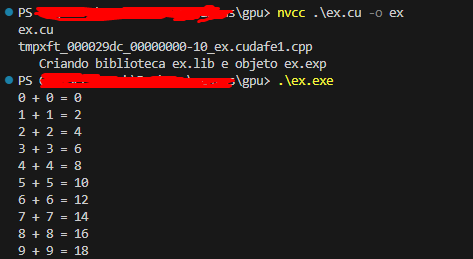

# **Soma de Vetores em CUDA**

Este projeto demonstra uma aplicação simples usando CUDA para somar dois vetores em paralelo utilizando a GPU. A execução utiliza um **kernel CUDA** para dividir o trabalho entre múltiplas **threads**.

## **Requisitos**

Para compilar e executar o código, você precisa de:

- **NVIDIA GPU** com suporte a CUDA.
- **NVIDIA CUDA Toolkit** instalado.

## **Compilação e Execução**

Para compilar o programa, use o compilador **`nvcc`** do CUDA Toolkit:

```bash
nvcc soma_vetores.cu -o soma_vetores
```

Agora só precisa disparar o executável.

```bash
./soma_vetores.exe
```



## **Explicação do Kernel CUDA**

A função **`add`** é o **kernel CUDA** responsável por somar os elementos dos vetores:

```cpp
__global__ void add(int *a, int *b, int *c, int n) {
    int index = threadIdx.x + blockIdx.x * blockDim.x;
    if (index < n) {
        c[index] = a[index] + b[index];
    }
}
```

### **Detalhes do Kernel**:

- **`threadIdx.x`**: Índice da thread dentro de um bloco.
- **`blockIdx.x`**: Índice do bloco.
- **`blockDim.x`**: Quantidade de threads em cada bloco.
- O índice global é calculado para identificar qual elemento do vetor será processado pela thread.

---

## **Distribuição de Threads e Blocos**

No código, o número de threads e blocos é definido como:

```cpp
int blockSize = 256;
int numBlocks = (n + blockSize - 1) / blockSize;
```

- **`blockSize`**: Número de threads por bloco (256 threads).
- **`numBlocks`**: Quantidade de blocos necessária para processar `n` elementos.
